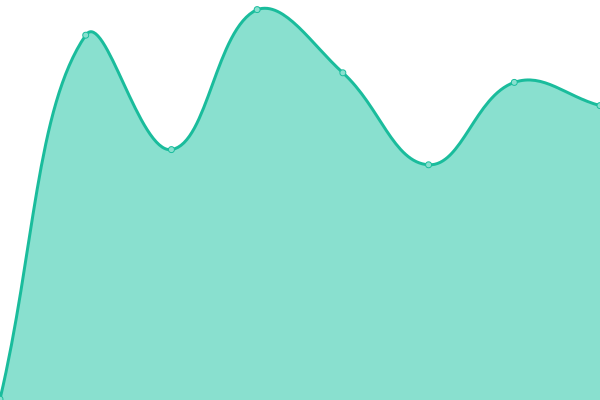

# [📈 Live Status](https://status.baizhiheizi.com): <!--live status--> **🟧 Partial outage**

This repository contains the open-source uptime monitor and status page for [白纸黑字](https://baizhiheizi.com), powered by [Upptime](https://github.com/upptime/upptime).

With [Upptime](https://upptime.js.org), you can get your own unlimited and free uptime monitor and status page, powered entirely by a GitHub repository. We use [Issues](https://github.com/baizhiheizi/upptime/issues) as incident reports, [Actions](https://github.com/baizhiheizi/upptime/actions) as uptime monitors, and [Pages](https://status.baizhiheizi.com) for the status page.

<!--start: status pages-->
<!-- This summary is generated by Upptime (https://github.com/upptime/upptime) -->
<!-- Do not edit this manually, your changes will be overwritten -->
<!-- prettier-ignore -->
| URL | Status | History | Response Time | Uptime |
| --- | ------ | ------- | ------------- | ------ |
|  [baizhiheizi](https://baizhiheizi.com) | 🟩 Up | [baizhiheizi.yml](https://github.com/baizhiheizi/upptime/commits/HEAD/history/baizhiheizi.yml) | 

 155ms
     
 | 

<a href="https://status.baizhiheizi.com/history/baizhiheizi">100.00%</a>
    

|  [Quill](https://quill.im) | 🟩 Up | [quill.yml](https://github.com/baizhiheizi/upptime/commits/HEAD/history/quill.yml) | 

 733ms
     
 | 

<a href="https://status.baizhiheizi.com/history/quill">100.00%</a>
    

|  [Quill API](https://quill.im/api/articles) | 🟩 Up | [quill-api.yml](https://github.com/baizhiheizi/upptime/commits/HEAD/history/quill-api.yml) | 

 2736ms
     
 | 

<a href="https://status.baizhiheizi.com/history/quill-api">97.24%</a>
    

|  [docs.quill.im](https://docs.quill.im) | 🟩 Up | [docs-quill-im.yml](https://github.com/baizhiheizi/upptime/commits/HEAD/history/docs-quill-im.yml) | 

 414ms
     
 | 

<a href="https://status.baizhiheizi.com/history/docs-quill-im">100.00%</a>
    

|  [OhMy](https://ohmy.xin) | 🟩 Up | [oh-my.yml](https://github.com/baizhiheizi/upptime/commits/HEAD/history/oh-my.yml) | 

 1933ms
     
 | 

<a href="https://status.baizhiheizi.com/history/oh-my">100.00%</a>
    

|  [docs.ohmy.xin](https://docs.ohmy.xin) | 🟥 Down | [docs-ohmy-xin.yml](https://github.com/baizhiheizi/upptime/commits/HEAD/history/docs-ohmy-xin.yml) | 

 0ms
     
 | 

<a href="https://status.baizhiheizi.com/history/docs-ohmy-xin">0.00%</a>
    

<!--end: status pages-->

[**Visit our status website →**](https://status.baizhiheizi.com)

## 📄 License

- Powered by: [Upptime](https://github.com/upptime/upptime)
- Code: [MIT](./LICENSE) © [白纸黑字](https://baizhiheizi.com)
- Data in the `./history` directory: [Open Database License](https://opendatacommons.org/licenses/odbl/1-0/)
